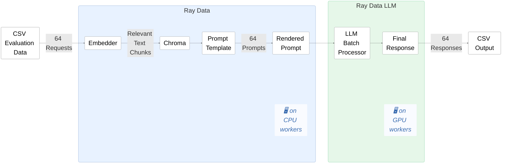
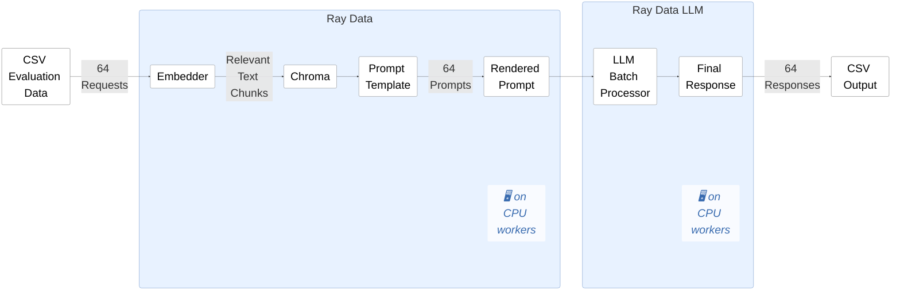

# Evaluate RAG using Batch Inference with Ray Data LLM

# Evaluate RAG using Batch Inference with Ray Data LLM on only CPU Workers

## Solve GPU Availbiltiy problems
   - Ray Cluster which processes data might not have GPU workers.  
   - Solve the problem by moving LLM infernece to CPU workers with a smaller model close to Data. 
## Save Cost
  - smaller model like Llama3.1 8B performs well on Intel Xeon 6.
  - save cost by serving small model on Xeon 6

